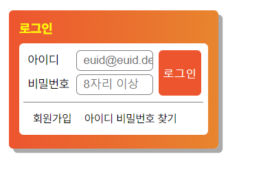

# Mission-02

- 소개
- 결과
- Markup 구조
 </br>


## 소개

web cafe 시안 중 로그인 폼 부분을 구현한 결과입니다.
</br>
</br>


## 결과

<p align="center">
  
</p>


## Markup 구조
-  전체 contents 영역으로 감싸준 후 form 태그를 통해 로그인 폼을 구현했습니다.
-  fieldset에서의 아이디, 비밀번호 영역은 inline-block 으로 정렬하였고, 로그인 버튼은 position absolute 로 top과 right로 위치를 조정했습니다. 
``` html
        <form>
        <fieldset>
            <label>아이디</label>
            <input> 
            <label>비밀번호</label>
            <input>
            <button>로그인</button> 
        </fieldset>
      </form>
```
 </br>
 

- ul의 li 태그를 통해 회원가입과 아이디/비밀번호 찾기를 마크업하고 해당 페이지로 이동할 수 있도록 a태그를 사용했습니다.
- 각 요소는 float: left를 통해 배치하고 가상요소에 clear: left 속성을 부여하여 레이아웃의 망가짐을 방지했습니다.  
```html      
        <ul>
          <li><a href="/">회원가입</a></li>
          <li><a href="/">아이디 비밀번호 찾기</a></li>
        </ul>
```
