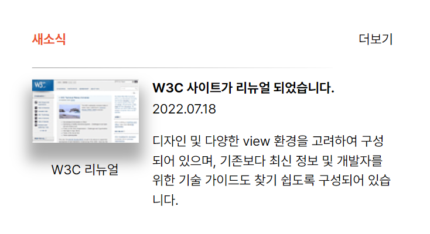
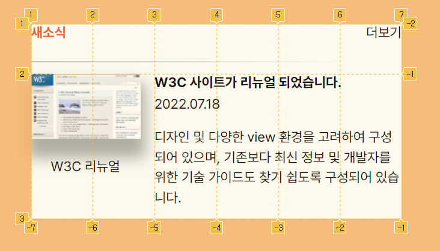

# Mission-03

- 소개
- 결과
- Markup 구조
</br>

## 소개
web cafe 시안 중 새소식 영역을 구현한 결과입니다.
</br>
</br>

## 결과
<p align="center">
  
</p>
<p align="center">
  
</p>
</br>
</br>

## Markup 구조
```
body
└── section.new-area
     ├── div.header 
     │    ├── h2.news
     │    └── span.more     
     ├── figure.news-img     
     │     ├── img
     │     └── figcaption      
     └── div.news-wrap    
           ├── p.new-title
           └── p.news-contents 
               └──time
             
```
- 전체 사이트 영역은 section으로 잡아주고 header, figure, contents 부분으로 나눴습니다.

- 그리드는 column을 1fr 1fr 1fr 1fr 1fr 1fr 으로 지정해줬습니다.
```
.news-area{
  display: grid;
  grid-template-columns: repeat(6, 1fr); 
  grid-template-rows: auto; 
  width: 23.75rem;
  height: 12.5rem;
}
``` 
- grid item
```
.header{
 grid-area:1/1/1/6 ;
}

.news-img{
  grid-area: 2/1/3/4;
}

.news-wrap{ 
  grid-area: 2/3/2/7;
}
```
