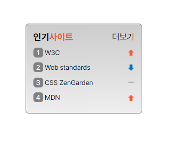

# Mission-05

- 소개
- 결과
- Markup 구조
</br>


## 소개
web cafe 시안 중 인기사이트 영역을 구현한 결과입니다.
</br>
</br>


## 결과
<p align="center">
  
</p>
</br>
</br>


## Markup 구조
```
body
└── section.favorite
     ├── h3.favorite-title 
     │    └── span     
     ├── section.favorite-site     
     │     └── ol.favorite-list
     │        ├── li.favorite-rank sprite sprite-up  
     │        │    └── a   
     │        ├── li.favorite-rank sprite sprite-down  
     │        │    └── a   
     │        ├── li.favorite-rank sprite sprite-stop  
     │        │    └── a   
     │        └── li.favorite-rank sprite sprite-up  
     │             └── a   
     └── span.favorite-more
          └── a
             
```
- section으로 전체 영역 잡아준 뒤, 인기사이트 리스트도 하나의 영역이라 생각되어 section 으로 묶어주고 li>a 로 각 사이트 리스트를 만들어줬습니다.
- 이미지 스프라이트 기법을 사용하기 위해 li에 sprite sprite-up / down / stop 클래스를 부여했습니다.
- ol의 기존 스타일은 제거해주고 li에 ::before 가상요소를 통해 counter() 를 사용하여 숫자를 자동으로 배치해주고 inline-block를 부여해 스타일을 주었습니다.

</br>


</br>

### CSS

```
.favorite{
  position: relative;
  padding: 12px;
  margin: 50px;
  width: 11.875rem;
  height: 9.1875rem;
  border: 1px solid gray;
  border-radius: 5px;
  background: linear-gradient(180deg, #CCCCCC 0%, #EEEEEE 100%); 
}

.favorite-more{
  position: absolute;
  top: 12px;
  right: 12px;
  font-size: 0.875rem;
}
```
- 상단 헤더 영역에 '더보기' 를 배치하기 위해 부모 클래스인 .favorite 에 position:relative 를 주고 .favorite-more에 position: absolute와 위치를 조정해주어 배치했습니다. 
</br>
</br>
</br>


```
.sprite{
  display: block; 
  width: 100%;
  height: 100%; 
  background: url(./rank.png) no-repeat;
}

.sprite-up{
  background-position: right 3.5px;
}

.sprite-stop{
  background-position: right -19px;
}

.sprite-down{
  background-position: right -41.5px;
}
```

- 기존에 ol태그에서 display:flex 설정해준 것을 스프라이트 기법을 사용하여 배치하기 위해 li를 block로 바꿔줍니다.
- width: 100%;로 부모의 width 길이의 100%를 차지하게 해준 뒤, 여러 이미지를 하나로 합쳐놓은 rank.png 이미지에서 background-position으로 으로 각각의 위치를 지정해줍니다.
